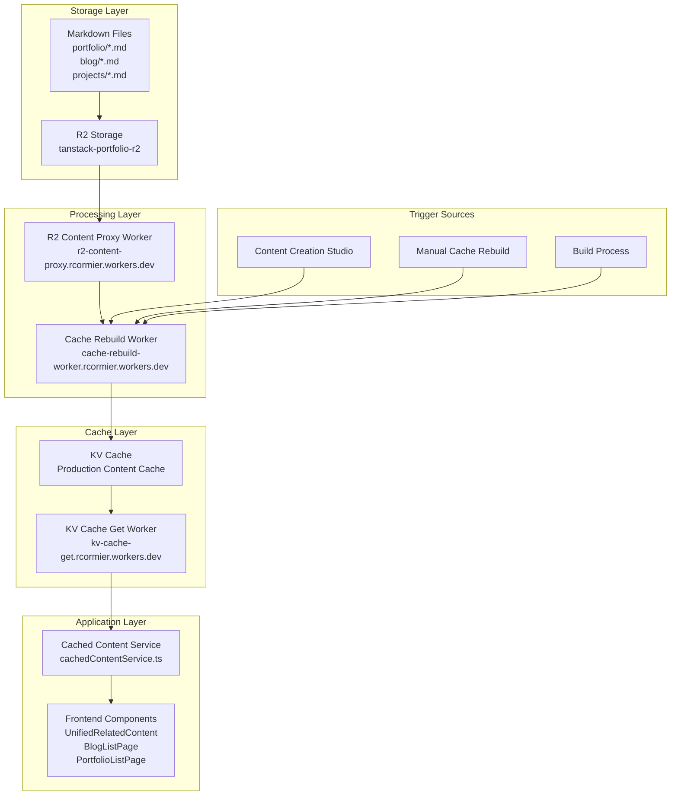

# Content Indexing and Cache System Documentation

## Overview

The TanStack Portfolio site implements a sophisticated content indexing and caching system that provides high-performance content delivery, intelligent recommendations, and seamless integration between R2 storage, KV cache, and Cloudflare Workers. This system eliminates the need for real-time R2 requests during page loads while providing advanced search and recommendation capabilities.

## 🏗️ System Architecture

### Core Components

- **R2 Storage**: `tanstack-portfolio-r2` bucket for content storage
- **R2 Content Proxy Worker**: CORS-enabled content delivery
- **KV Cache**: Production content cache for fast access
- **Cache Rebuild Worker**: Automated cache population and management
- **KV Cache Get Worker**: Direct cache access endpoint
- **Cached Content Service**: Frontend service for content operations
- **Fuse.js Integration**: Advanced semantic search capabilities

### Technology Stack

- **Storage**: Cloudflare R2 (Object Storage)
- **Cache**: Cloudflare KV (Key-Value Store)
- **Workers**: Cloudflare Workers (JavaScript/TypeScript)
- **Search**: Fuse.js (Fuzzy Search Library)
- **Frontend**: React + TypeScript + Tailwind CSS
- **Build**: Vite + TypeScript compilation

## 📊 Content Flow Architecture

### Data Flow Diagram



## 🔧 R2 Storage Configuration

### R2 Bucket Structure

```
tanstack-portfolio-r2/
├── portfolio/
│   ├── analytics.md
│   ├── erp-integration.md
│   └── project-management.md
├── blog/
│   ├── digital-transformation.md
│   ├── ai-automation.md
│   └── technical-leadership.md
├── projects/
│   ├── netsuite-implementation.md
│   ├── ramp-integration.md
│   └── cloudflare-migration.md
└── assets/
    ├── images/
    └── files/
```

### R2 Content Proxy Worker

**Purpose**: Resolves CORS issues when accessing R2 content directly from custom domains.

**Features**:

- CORS header management
- Content listing endpoints
- Path validation and security
- Error handling and logging

**Configuration**:

```toml
# wrangler/wrangler-r2-proxy.toml
name = "r2-content-proxy"
main = "../workers/r2-content-proxy.ts"

[[r2_buckets]]
binding = "PORTFOLIO_CONTENT"
bucket_name = "tanstack-portfolio-r2"
```

**API Endpoints**:

- `GET /_list?prefix=blog/` - List content in directory
- `GET /portfolio/analytics.md` - Retrieve specific content file
- `GET /blog/post.md` - Retrieve blog post content

## 🗄️ KV Cache System

### Cache Structure

The KV cache stores a comprehensive content index with the following structure:

```typescript
interface CachedContentItem {
  id: string;
  title: string;
  description: string;
  url: string;
  contentType: 'blog' | 'portfolio' | 'project' | 'page';
  category: string;
  tags: string[];
  keywords: string[];
  content: string;
  relevanceScore?: number;
  date?: string;
  fileName: string;
  readTime?: number;
}

interface CacheData {
  portfolio: CachedContentItem[];
  blog: CachedContentItem[];
  projects: CachedContentItem[];
  all: CachedContentItem[];
  metadata: {
    portfolioCount: number;
    blogCount: number;
    projectCount: number;
    lastUpdated: string;
    version: string;
    trigger: string;
  };
}
```

### Cache Rebuild Worker

**Purpose**: Automatically populates and manages the KV cache from R2 content.

**Features**:

- Automated content indexing
- Frontmatter parsing
- Content metadata extraction
- Cache versioning and management
- Error handling and logging

**Configuration**:

```toml
# wrangler/wrangler-cache-rebuild.toml
name = "cache-rebuild-worker"
main = "../workers/cache-rebuild-worker.ts"

[[kv_namespaces]]
binding = "CONTENT_CACHE"
id = "content-cache-kv-namespace"

[[r2_buckets]]
binding = "PORTFOLIO_CONTENT"
bucket_name = "tanstack-portfolio-r2"
```

**API Endpoints**:

- `POST /rebuild` - Trigger manual cache rebuild
- `POST /rebuild/content` - Trigger content studio rebuild
- `GET /status` - Get cache status and health

### KV Cache Get Worker

**Purpose**: Provides direct access to cached content for all environments.

**Features**:

- Fast cache retrieval
- CORS-enabled responses
- Error handling
- Cache validation

**Configuration**:

```toml
# wrangler/wrangler-kv-cache-get.toml
name = "kv-cache-get"
main = "../workers/kv-cache-get.ts"

[[kv_namespaces]]
binding = "CONTENT_CACHE"
id = "content-cache-kv-namespace"
```

## 🔍 Content Service Implementation

### Cached Content Service

The `CachedContentService` provides a comprehensive interface for content operations:

```typescript
export class CachedContentService {
  // Core content retrieval
  async getContentByType(
    contentType: 'blog' | 'portfolio' | 'project'
  ): Promise<CachedContentItem[]>;
  async getAllContent(): Promise<CachedContentItem[]>;

  // Search and recommendations
  async searchContent(
    request: CachedSearchRequest
  ): Promise<CachedSearchResponse>;
  async getRecommendations(
    request: CachedRecommendationsRequest
  ): Promise<CachedRecommendationsResponse>;

  // Utility methods
  isReady(): boolean;
  getContentMetadata(): ContentMetadata;
  reinitializeFuse(): Promise<void>;
}
```

### Search and Recommendation Engine

**Fuse.js Configuration**:

```typescript
const fuseOptions: IFuseOptions<CachedContentItem> = {
  keys: [
    { name: 'title', weight: 0.4 },
    { name: 'description', weight: 0.3 },
    { name: 'content', weight: 0.2 },
    { name: 'tags', weight: 0.15 },
    { name: 'keywords', weight: 0.15 },
    { name: 'category', weight: 0.1 },
  ],
  threshold: 0.3,
  distance: 100,
  includeScore: true,
  includeMatches: true,
  minMatchCharLength: 3,
  ignoreLocation: true,
  useExtendedSearch: true,
};
```

**Relevance Scoring Algorithm**:

- Title match: 25 points (highest weight)
- Description match: 15 points
- Content match: 10 points
- Tags match: 12 points per match
- Keywords match: 8 points per match
- Category match: 10 points
- Content quality bonus: 5-10 points
- Normalized to 0-100 range

## 🚀 Cache Management

### Automatic Cache Rebuild

**Triggers**:

1. **Build Process**: Automatic rebuild during `npm run build`
2. **Content Studio**: Manual rebuild from content creation interface
3. **Scheduled**: Daily automated rebuilds via cron jobs
4. **Manual**: Developer-initiated rebuilds

**Rebuild Process**:

1. Fetch all content from R2 via proxy worker
2. Parse frontmatter and extract metadata
3. Generate content IDs and URLs
4. Calculate reading times and relevance scores
5. Store in KV cache with versioning
6. Update cache metadata and timestamps

### Cache Rebuild Service

The `cacheRebuildService.ts` provides frontend utilities for cache management:

```typescript
// Trigger cache rebuild from content studio
export async function triggerContentStudioRebuild(): Promise<CacheRebuildResponse>;

// Trigger manual cache rebuild
export async function triggerManualRebuild(): Promise<CacheRebuildResponse>;

// Get cache status and health
export async function getCacheStatus(): Promise<CacheStatus>;

// Get current cache data
export async function getCurrentCacheData(): Promise<CacheData>;

// Enhanced cache status with current data
export async function getEnhancedCacheStatus(): Promise<CacheStatus>;
```

## 📱 Frontend Integration

### Component Usage

**Blog List Page**:

```typescript
useEffect(() => {
  const loadBlogs = async () => {
    const blogs = await cachedContentService.getContentByType('blog');
    setBlogPosts(blogs);
  };
  loadBlogs();
}, []);
```

**Related Content Component**:

```typescript
const getRelatedContent = async (currentUrl: string, query: string) => {
  const recommendations = await cachedContentService.getRecommendations({
    query,
    maxResults: 3,
    excludeUrl: currentUrl,
  });
  return recommendations.results;
};
```

**Search Implementation**:

```typescript
const searchContent = async (query: string, contentType?: string) => {
  const results = await cachedContentService.searchContent({
    query,
    contentType: contentType || 'all',
    maxResults: 10,
  });
  return results.results;
};
```

## 🔧 Configuration and Deployment

### Environment Configuration

**R2 Configuration**:

```typescript
export const R2_CONFIG = {
  BASE_URL: 'https://r2-content-proxy.rcormier.workers.dev',
  BUCKET_NAME: 'tanstack-portfolio-r2',
  DIRECTORIES: {
    PORTFOLIO: 'portfolio',
    BLOG: 'blog',
    PROJECTS: 'projects',
  },
  CACHE: {
    DURATION: 3600, // 1 hour
    ENABLED: true,
  },
};
```

**Worker URLs**:

```typescript
const WORKER_URLS = {
  CACHE_REBUILD: 'https://cache-rebuild-worker.rcormier.workers.dev',
  KV_CACHE_GET: 'https://kv-cache-get.rcormier.workers.dev',
  R2_PROXY: 'https://r2-content-proxy.rcormier.workers.dev',
};
```

### Build Process Integration

**Package.json Scripts**:

```json
{
  "scripts": {
    "build": "npm run build:content && vite build",
    "build:content": "node scripts/rebuild-kv-cache.js",
    "rebuild-kv": "node scripts/rebuild-kv-cache.js",
    "build:dev": "vite build"
  }
}
```

**Build Steps**:

1. Content indexing and KV cache population
2. TypeScript compilation
3. Vite production build
4. Asset optimization and bundling

## 📊 Performance Optimization

### Caching Strategy

**Multi-Layer Caching**:

1. **R2 Storage**: Primary content storage
2. **KV Cache**: Production content index
3. **Worker Cache**: In-memory caching
4. **Browser Cache**: HTTP caching headers

**Cache Headers**:

```typescript
headers: {
  'Cache-Control': 'public, max-age=300', // 5 minutes
  'Access-Control-Allow-Origin': '*',
}
```

### Performance Metrics

**Response Times**:

- KV cache retrieval: < 50ms
- Content search: < 100ms
- Recommendations: < 150ms
- Cache rebuild: 2-5 seconds

**Scalability**:

- Supports 1000+ content items
- Handles concurrent requests
- Automatic cache invalidation
- Efficient memory usage

## 🔐 Security and Access Control

### CORS Configuration

**R2 Proxy Worker**:

```typescript
const corsHeaders = {
  'Access-Control-Allow-Origin': '*',
  'Access-Control-Allow-Methods': 'GET, HEAD, OPTIONS',
  'Access-Control-Allow-Headers': 'Content-Type, Authorization',
  'Access-Control-Allow-Credentials': 'false',
  'Access-Control-Max-Age': '86400',
};
```

### Path Validation

**Allowed Paths**:

```typescript
const allowedPaths = ['blog/', 'portfolio/', 'projects/', 'trash/', ''];
const allowedExtensions = ['.md', '.json'];
```

### Rate Limiting

**KV-Based Rate Limiting**:

```typescript
const RATE_LIMITS = {
  requestsPerMinute: 60,
  requestsPerHour: 1000,
};
```

## 🧪 Testing

### Debugging and Monitoring

**Logging**:

- Comprehensive console logging
- Error tracking and reporting
- Performance metrics
- Cache hit/miss statistics

**Health Checks**:

```typescript
// Check cache health
const isHealthy = await cachedContentService.isReady();

// Get cache status
const status = await getCacheStatus();

// Monitor performance
const metrics = await getPerformanceMetrics();
```

## 🚨 Error Handling and Fallbacks

### Graceful Degradation

**Fallback Chain**:

1. **Primary**: KV cache retrieval
2. **Secondary**: R2 proxy worker
3. **Tertiary**: Empty results with user notification

**Error Scenarios**:

- KV cache unavailable
- R2 proxy worker down
- Network connectivity issues
- Content parsing errors

**Error Recovery**:

```typescript
try {
  const content = await cachedContentService.getContentByType('blog');
  return content;
} catch (error) {
  logger.error('Content retrieval failed:', error);
  return []; // Graceful fallback
}
```

## 📈 Analytics and Monitoring

### Cache Performance Metrics

**Key Metrics**:

- Cache hit rate
- Response times
- Error rates
- Content freshness
- Search relevance scores

**Monitoring Dashboard**:

- Real-time cache status
- Performance graphs
- Error tracking
- Usage statistics
