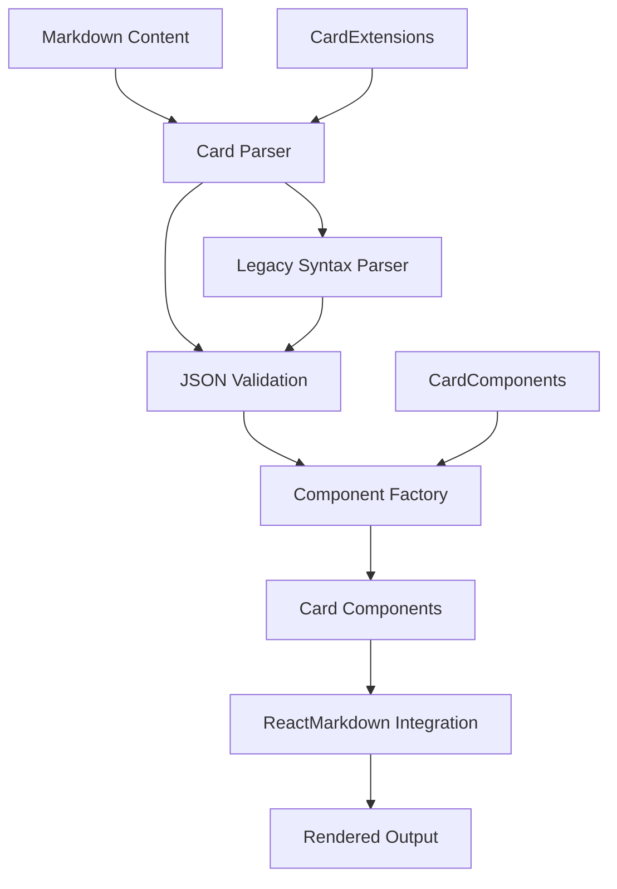

# Custom Markdown Card System

## Overview

The Custom Markdown Card System provides a powerful way to create beautiful, interactive cards directly within markdown content using a JSON-based syntax. The system integrates seamlessly with ReactMarkdown and renders using shadcn/ui components with a consistent teal-blue brand aesthetic.

## Table of Contents

1. [System Architecture](#system-architecture)
2. [Syntax & Usage](#syntax--usage)
3. [Card Types](#card-types)
4. [Advanced Features](#advanced-features)
5. [Integration & Rendering](#integration--rendering)
6. [Best Practices](#best-practices)
7. [Troubleshooting](#troubleshooting)
8. [Technical Implementation](#technical-implementation)

## System Architecture

### Core Components

- **Card Parser** (`markdownCardParser.ts`): Handles JSON parsing and card data extraction
- **Card Renderer** (`CardComponents.tsx`): React components for each card type
- **Markdown Integration** (`EnhancedMarkdownWithCards.tsx`): ReactMarkdown integration with card processing
- **Content Processing** (`markdownCardExtensions.ts`): Legacy syntax support and content parsing

### Rendering Pipeline

1. **Markdown Processing**: Content is scanned for card blocks using regex patterns
2. **JSON Parsing**: Card blocks are parsed into structured data objects
3. **Component Rendering**: Cards are rendered as React components with proper styling
4. **Integration**: Cards are seamlessly integrated with regular markdown content

## Syntax & Usage

### Basic Syntax

The system uses code blocks with the "card" language identifier:

````markdown
```card
{
  "type": "info",
  "props": {
    "title": "Card Title",
    "description": "Card description"
  },
  "content": "Your card content here with **markdown** support."
}
```
````

### Syntax Requirements

- **Critical**: There must be a space between backticks and "card" (```` card`)
- **JSON Format**: Content must be valid JSON with proper escaping
- **Required Fields**: `type`, `props`, and `content` are mandatory
- **Content Support**: Full markdown formatting is supported within content

### Legacy Syntax Support

The system also supports legacy syntax for backward compatibility:

```markdown
:::card[type]{props}
content
:::
```

## Card Types

### 1. Info Card

Basic informational card with teal styling and accent line.

**Props:**

- `title` (string): Card title
- `description` (string): Card description
- `badges` (string|array): Comma-separated badges or array

**Example:**

````markdown
```card
{
  "type": "info",
  "props": {
    "title": "Important Note",
    "description": "This is a key point to remember",
    "badges": "Important, Notice, Key Point"
  },
  "content": "This is the main content with **bold text**, *italic text*, and other markdown formatting.\n\n## Key Features\n- **Bold emphasis** for important points\n- *Italic styling* for subtle emphasis\n- `Inline code` for technical terms\n\n> This is a blockquote that stands out."
}
```
````

### 2. Hero Card

Large, prominent cards for key content with optional images and CTAs.

**Props:**

- `title` (string): Hero title
- `description` (string): Hero description
- `size` (string): "sm", "md", "lg"
- `image` (string): Optional image URL
- `imageAlt` (string): Image alt text
- `badges` (string|array): Badge text
- `cta` (object): Call-to-action button
  - `text` (string): Button text
  - `link` (string): Button URL
  - `variant` (string): "default", "outline", "secondary"

**Example:**

````markdown
```card
{
  "type": "hero",
  "props": {
    "title": "Leadership Philosophy",
    "description": "Core principles that guide my approach",
    "size": "lg",
    "badges": "PMP Certified, U.S. Army Veteran, Technical Leader",
    "image": "/images/profile.jpg",
    "imageAlt": "Profile image",
    "cta": {
      "text": "Learn More",
      "link": "https://example.com",
      "variant": "default"
    }
  },
  "content": "Your hero content here with **markdown** support."
}
```
````

### 3. Hero Profile Card

Specialized profile card for main profile display with multi-colored badges.

**Props:**

- `name` (string): Full name
- `title` (string): Professional title
- `description` (string): Professional description
- `image` (string): Profile image URL
- `imageAlt` (string): Image alt text
- `badges` (string|array): Multi-colored badges

**Example:**

````markdown
```card
{
  "type": "hero-profile",
  "props": {
    "name": "Roger Lee Cormier",
    "title": "Technical Project Manager",
    "description": "Driving digital transformation through cloud-native solutions and strategic leadership",
    "image": "/images/profile.jpg",
    "imageAlt": "Roger Cormier profile image",
    "badges": "PMP Certified, U.S. Army Veteran, Cloud Expert, DevOps Specialist"
  },
  "content": "Experienced technical project manager with a proven track record of leading complex digital transformation initiatives.\n\n## Core Competencies\n- **Strategic Leadership**: PMP-certified project management\n- **Technical Excellence**: Cloud platforms and DevOps automation\n- **Business Impact**: 98% on-time delivery rate\n- **Innovation Focus**: AI/ML integration and workflow automation"
}
```
````

### 4. Success Card

Green-accented cards for positive content with icons.

**Props:**

- `title` (string): Card title
- `description` (string): Card description
- `icon` (string): Icon name ("check", "award", "star", "target")
- `badges` (string|array): Badge text

**Example:**

````markdown
```card
{
  "type": "success",
  "props": {
    "title": "Project Success",
    "description": "Consistent delivery excellence",
    "icon": "target",
    "badges": "On-Time Delivery, Client Satisfaction, Quality Assurance"
  },
  "content": "98% on-time delivery rate across 25+ enterprise projects with zero critical issues."
}
```
````

### 5. Warning Card

Orange-accented cards for important notices with icons.

**Props:**

- `title` (string): Card title
- `description` (string): Card description
- `icon` (string): Icon name ("alert", "info", "shield", "lock")
- `badges` (string|array): Badge text

**Example:**

````markdown
```card
{
  "type": "warning",
  "props": {
    "title": "Security First",
    "description": "Enterprise-grade protection",
    "icon": "shield",
    "badges": "Zero-Trust, Compliance, Audit-Ready"
  },
  "content": "All implementations follow zero-trust principles with comprehensive audit trails."
}
```
````

### 6. Tech Card

Blue-accented cards for technical content with technology badges.

**Props:**

- `title` (string): Card title
- `description` (string): Card description
- `icon` (string): Icon name ("code", "database", "cloud", "rocket", "zap")
- `badges` (string|array): Technology badges

**Example:**

````markdown
```card
{
  "type": "tech",
  "props": {
    "title": "Cloud Expertise",
    "description": "Modern platform mastery",
    "icon": "cloud",
    "badges": "Azure, Cloudflare, GitHub Actions"
  },
  "content": "Specialized in cloud-native architectures and edge computing with AI-augmented workflows."
}
```
````

### 7. Feature Card

Feature cards with icons, badges, and optional links.

**Props:**

- `title` (string): Feature title
- `description` (string): Feature description
- `icon` (string): Icon name ("award", "briefcase", "graduation", "star", "trending", "shield", "zap")
- `badges` (string|array): Feature badges
- `link` (string): Optional link URL
- `linkText` (string): Link text (default: "Learn More")

**Example:**

````markdown
```card
{
  "type": "feature",
  "props": {
    "title": "Cloud Integration",
    "description": "Seamless cloud platform integration",
    "icon": "zap",
    "badges": "Azure, Cloudflare, DevOps",
    "link": "https://example.com",
    "linkText": "Learn More"
  },
  "content": "Our cloud integration services help you modernize legacy systems and leverage cloud-native architectures."
}
```
````

### 8. Profile Card

Profile cards with images, contact info, and badges.

**Props:**

- `name` (string): Full name
- `role` (string): Professional role
- `image` (string): Profile image URL
- `imageAlt` (string): Image alt text
- `badges` (string|array): Professional badges
- `contact` (object): Contact information
  - `email` (string): Email address
  - `phone` (string): Phone number
  - `github` (string): GitHub URL
  - `website` (string): Website URL

**Example:**

````markdown
```card
{
  "type": "profile",
  "props": {
    "name": "Roger Lee Cormier",
    "role": "Technical Project Manager",
    "image": "/images/profile.jpg",
    "imageAlt": "Profile image",
    "badges": "PMP Certified, U.S. Army NCO, Cloud & DevOps",
    "contact": {
      "email": "roger@example.com",
      "phone": "555-123-4567",
      "github": "https://github.com/rcormier",
      "website": "https://rcormier.dev"
    }
  },
  "content": "Experienced technical project manager specializing in digital transformation and cloud-native solutions."
}
```
````

### 9. Stats Card

Cards displaying statistics and metrics in a structured format.

**Props:**

- `title` (string): Stats title
- `description` (string): Stats description
- `stats` (string|array): Stats data

**Content Format:**
Use colon-separated format for stats:

```
Label: Value
Another Label: Another Value
```

**Example:**

````markdown
```card
{
  "type": "stats",
  "props": {
    "title": "Project Metrics",
    "description": "Key performance indicators"
  },
  "content": "Projects Completed: 25\nSuccess Rate: 98%\nClient Satisfaction: 4.9/5\nTeam Size: 12"
}
```
````

### 10. Timeline Card

Cards showing chronological events and milestones.

**Props:**

- `title` (string): Timeline title
- `description` (string): Timeline description
- `items` (array): Timeline items (optional, can be parsed from content)

**Content Format:**
Use pipe-separated format:

```
Date | Title | Description | Badge
```

**Example:**

````markdown
```card
{
  "type": "timeline",
  "props": {
    "title": "Career Timeline",
    "description": "Professional milestones"
  },
  "content": "2023-01-15 | Senior Technical PM | Led digital transformation initiative | Current\n2021-06-01 | Technical Project Manager | ERP modernization projects | Completed\n2019-03-15 | U.S. Army NCO | Signal Corps operations | Veteran"
}
```
````

### 11. Multi-Column Layout

Create responsive 2 or 3 column layouts with different card types.

**Props:**

- `columns` (number): Number of columns (2 or 3)
- `cards` (array): Array of card objects

**Example:**

````markdown
```card
{
  "type": "columns",
  "props": {},
  "content": "{\n  \"columns\": 3,\n  \"cards\": [\n    {\n      \"type\": \"success\",\n      \"props\": {\n        \"title\": \"Project Success\",\n        \"description\": \"Consistent delivery excellence\",\n        \"icon\": \"target\",\n        \"badges\": \"On-Time Delivery, Quality Assurance\"\n      },\n      \"content\": \"98% on-time delivery rate.\"\n    },\n    {\n      \"type\": \"tech\",\n      \"props\": {\n        \"title\": \"Cloud Expertise\",\n        \"description\": \"Modern platform mastery\",\n        \"icon\": \"cloud\",\n        \"badges\": \"Azure, Cloudflare, GitHub Actions\"\n      },\n      \"content\": \"Specialized in cloud-native architectures.\"\n    },\n    {\n      \"type\": \"warning\",\n      \"props\": {\n        \"title\": \"Security First\",\n        \"description\": \"Enterprise-grade protection\",\n        \"icon\": \"shield\",\n        \"badges\": \"Zero-Trust, Compliance\"\n      },\n      \"content\": \"Zero-trust principles with audit trails.\"\n    }\n  ]\n}"
}
```
````

## Advanced Features

### Markdown Content Support

All card content supports full markdown formatting:

- **Text Formatting**: Bold (`**text**`), italic (`*text*`), strikethrough (`~~text~~`)
- **Code**: Inline code (`` `code` ``) with syntax highlighting
- **Links**: `[text](url)` with proper styling
- **Lists**: Bullet points (`- item`) and numbered lists (`1. item`)
- **Blockquotes**: `> text` with teal accent styling
- **Headers**: `# H1`, `## H2`, `### H3` with proper hierarchy

### Badge System

Unified badge system across all card types with automatic color cycling:

**Color Palette:**

- **Blue**: Professional certifications and credentials
- **Green**: Success metrics and achievements
- **Orange**: Technical skills and expertise
- **Red**: Security and compliance focus
- **Purple**: Innovation and emerging technologies

**Format Options:**

- **String**: `"badges": "Badge 1, Badge 2, Badge 3"`
- **Array**: `"badges": ["Badge 1", "Badge 2", "Badge 3"]`

### Icon System

Comprehensive icon library using Lucide React:

**Available Icons by Category:**

- **Success**: `check`, `award`, `star`, `target`
- **Warning**: `alert`, `info`, `shield`, `lock`
- **Tech**: `code`, `database`, `cloud`, `rocket`, `zap`
- **Feature**: `award`, `briefcase`, `graduation`, `star`, `trending`, `shield`, `zap`

### Responsive Design

All cards are fully responsive with:

- **Mobile-first**: Optimized for mobile devices
- **Grid layouts**: Automatic column adjustment
- **Text wrapping**: Proper word breaking and overflow handling
- **Image scaling**: Responsive images with proper aspect ratios

## Integration & Rendering

### ReactMarkdown Integration

The system integrates seamlessly with ReactMarkdown:

1. **Content Processing**: Markdown is scanned for card blocks
2. **Component Extraction**: Cards are parsed and converted to React components
3. **Placeholder Replacement**: Card blocks are replaced with placeholders
4. **Final Rendering**: Content is rendered with cards integrated

### Rendering Components

- **EnhancedMarkdownWithCards**: Main integration component
- **MarkdownWithCards**: Legacy integration component
- **CustomCardBlock**: Individual card block processor
- **CardComponents**: Individual card type components

### Performance Optimizations

- **Lazy Loading**: Cards are rendered on-demand
- **Memoization**: Components are memoized for performance
- **Efficient Parsing**: Regex-based parsing for fast processing
- **Minimal Re-renders**: Optimized React rendering patterns

## Best Practices

### Content Organization

1. **Keep Content Concise**: Cards work best with focused, scannable content
2. **Use Appropriate Types**: Match card type to content purpose
3. **Include Relevant Badges**: Use badges to highlight key technologies or achievements
4. **Provide Context**: Use descriptions to provide additional context

### Syntax Guidelines

1. **Valid JSON**: Ensure all JSON is properly formatted and escaped
2. **Consistent Formatting**: Use consistent indentation and structure
3. **Error Handling**: Test cards before deploying to production
4. **Documentation**: Document complex card configurations

### Design Consistency

1. **Brand Colors**: Stick to the teal-blue color scheme
2. **Typography**: Use consistent font families and sizing
3. **Spacing**: Maintain consistent spacing and margins
4. **Accessibility**: Ensure proper alt text and semantic markup

### Performance Considerations

1. **Image Optimization**: Optimize images for web delivery
2. **Content Length**: Keep content reasonable in length
3. **Badge Count**: Limit badges to essential information
4. **Nested Content**: Avoid deeply nested markdown structures

## Troubleshooting

### Common Issues

**Cards Not Rendering:**

- Ensure there's a space between backticks and "card" (```` card`)
- Check JSON syntax for proper brackets and braces
- Verify all required fields are present

**Styling Issues:**

- Check for CSS conflicts with existing styles
- Verify Tailwind classes are properly applied
- Ensure dark mode compatibility

**Content Parsing Errors:**

- Validate JSON syntax using a JSON validator
- Check for proper escaping of quotes and special characters
- Verify markdown syntax within content

**Performance Issues:**

- Optimize images and reduce file sizes
- Limit the number of badges and complex content
- Consider lazy loading for large card collections

### Debug Mode

Enable debug mode by adding `debug: true` to card props:

````markdown
```card
{
  "type": "info",
  "props": {
    "title": "Debug Card",
    "debug": true
  },
  "content": "This card will show debug information."
}
```
````

### Error Handling

The system includes comprehensive error handling:

- **JSON Parsing**: Graceful fallback for invalid JSON
- **Missing Props**: Default values for missing properties
- **Unknown Types**: Error display for unsupported card types
- **Content Errors**: Fallback rendering for malformed content

## Technical Implementation

### Architecture Overview



### Key Files

- **`src/utils/markdownCardParser.ts`**: Core parsing and rendering logic
- **`src/components/markdown/CardComponents.tsx`**: React components for all card types
- **`src/components/markdown/EnhancedMarkdownWithCards.tsx`**: ReactMarkdown integration
- **`src/utils/markdownCardExtensions.ts`**: Legacy syntax support

### Data Flow

1. **Input**: Markdown content with card blocks
2. **Parsing**: Regex-based extraction of card blocks
3. **Validation**: JSON parsing and validation
4. **Rendering**: React component creation and rendering
5. **Integration**: Seamless integration with markdown content
6. **Output**: Fully rendered content with styled cards

### Extension Points

The system is designed for extensibility:

- **New Card Types**: Add new card types by extending the component library
- **Custom Props**: Add new props to existing card types
- **Styling Customization**: Override default styles with CSS classes
- **Integration Hooks**: Extend integration with custom processing logic

---

**Last Updated**: January 2025  
**Version**: 2.0.0  
**Author**: Roger Lee Cormier  
**License**: Private/Proprietary
