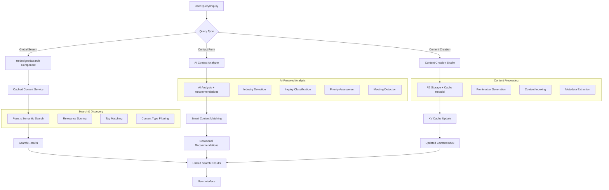

# Search and Content Capabilities System Documentation

## Overview

The TanStack Portfolio implements a sophisticated, AI-powered content discovery and search system that integrates multiple search interfaces, semantic content matching, intelligent recommendations, and cross-content type discovery. The system features advanced AI contact analysis, smart content recommendations, and seamless integration between content creation, indexing, and search capabilities.

## 🏗️ System Architecture

### Core Components

- **Global Search System**: Universal search interface with semantic matching
- **Content Creation Studio**: Integrated content management with AI frontmatter generation
- **AI Contact Analyzer**: Intelligent inquiry analysis with content recommendations
- **Cached Content Service**: High-performance content indexing and retrieval
- **Smart Recommendations Engine**: Context-aware content discovery
- **Multi-Layer Caching**: R2 storage, KV cache, and browser caching

### Technology Stack

- **Search Engine**: Fuse.js with semantic matching and fallback algorithms
- **AI Integration**: Cloudflare AI models for content analysis and generation
- **Storage**: Cloudflare R2 for content, KV for caching
- **Workers**: Multiple specialized workers for content processing
- **Frontend**: React with TypeScript and Tailwind CSS
- **Content Processing**: TipTap editor with Markdown conversion

## 📊 Content Discovery Flow

### Data Flow Diagram



## 🔍 Global Search System

### RedesignedSearch Component

The primary search interface providing universal access across all pages.

#### Advanced Features

- **Universal Access**: Available on every page via header with `Ctrl/Cmd + K`
- **Semantic Search**: Fuse.js-powered fuzzy search with intelligent matching
- **Recent Searches**: Stores last 5 searches in localStorage with persistence
- **Content Type Filtering**: Cross-content search (portfolio, blog, projects, pages)
- **Relevance Scoring**: Multi-factor scoring with visual indicators
- **Keyboard Navigation**: Full keyboard support for accessibility

#### Search Configuration

```typescript
const fuseOptions: IFuseOptions<CachedContentItem> = {
  keys: [
    { name: 'title', weight: 0.4 }, // 40% - Highest priority
    { name: 'description', weight: 0.3 }, // 30% - Content summary
    { name: 'content', weight: 0.2 }, // 20% - Full content
    { name: 'tags', weight: 0.15 }, // 15% - Tag matching
    { name: 'keywords', weight: 0.15 }, // 15% - Keyword matching
    { name: 'category', weight: 0.1 }, // 10% - Category classification
  ],
  threshold: 0.3, // Matching precision
  distance: 100, // Edit distance tolerance
  includeScore: true, // Include relevance scores
  includeMatches: true, // Include match details
  minMatchCharLength: 3, // Minimum match length
  ignoreLocation: true, // Location-independent matching
  useExtendedSearch: true, // Advanced search syntax
};
```

#### Search Results Display

- **Content Type Icons**: Visual indicators for different content types
- **Relevance Badges**: Color-coded relevance scores (Excellent, Very Good, Good, Fair, Basic)
- **Tag Display**: Shows up to 4 tags with "+X more" indicator
- **Category Information**: Displays content category and relevance percentage
- **External Link Icons**: Visual cues for navigation
- **Responsive Layout**: Adaptive design for all device sizes

## 🤖 AI-Powered Content Discovery

### Contact Analysis Integration

The AI contact analyzer provides intelligent content recommendations based on user inquiries.

#### AI Analysis Capabilities

```typescript
interface AIAnalysisResult {
  inquiryType:
    | 'consultation'
    | 'project'
    | 'partnership'
    | 'general'
    | 'urgent';
  priorityLevel: 'high' | 'medium' | 'low';
  industry:
    | 'technology'
    | 'healthcare'
    | 'finance'
    | 'manufacturing'
    | 'retail'
    | 'education'
    | 'government'
    | 'nonprofit'
    | 'startup'
    | 'enterprise'
    | 'other';
  projectScope: 'small' | 'medium' | 'large' | 'enterprise';
  urgency: 'immediate' | 'soon' | 'flexible';
  messageType: 'message' | 'meeting-request';
  suggestedResponse: string;
  meetingDuration: '30 minutes' | '1 hour' | '1.5 hours' | '2 hours';
  relevantContent: string[];
  shouldScheduleMeeting: boolean;
  meetingType:
    | 'consultation'
    | 'project-planning'
    | 'technical-review'
    | 'strategy-session'
    | 'general-discussion';
  recommendedTimeSlots: string[];
  timezoneConsideration: string;
  userTimezone: string;
  followUpRequired: boolean;
  redFlags: string[];
  followUpQuestions: string[];
  confidence: number;
  timestamp: string;
  originalMessage: string;
  wordCount: number;
  hasCompany: boolean;
  emailDomain: string;
}
```

#### Smart Content Recommendations

```typescript
const getContentRecommendations = useCallback(
  async (analysis: AIAnalysisResult) => {
    const title = `Inquiry: ${analysis.inquiryType} - ${analysis.industry}`;
    const tags = [
      analysis.inquiryType,
      analysis.industry,
      analysis.projectScope,
    ].filter(Boolean);

    const response = await cachedContentService.getRecommendations({
      query: title,
      contentType: 'all',
      maxResults: 4,
      tags: tags,
      context: {
        inquiryType: analysis.inquiryType,
        industry: analysis.industry,
        projectScope: analysis.projectScope,
        messageType: analysis.messageType,
        priorityLevel: analysis.priorityLevel,
      },
    });

    return response.results.map(item => ({
      title: item.title,
      path: item.url,
      description: item.description,
      relevance: item.relevanceScore || 0,
      contentType: item.contentType,
      tags: item.tags,
    }));
  },
  []
);
```

### Portfolio Assistant

The site assistant provides intelligent content recommendations based on user queries.

#### Assistant Features

- **Natural Language Processing**: Understands user intent and context
- **Cross-Content Recommendations**: Suggests relevant portfolio, blog, and project content
- **Confidence Scoring**: Provides relevance scores for recommendations
- **Contextual Awareness**: Considers current page and user behavior
- **Interactive Interface**: Chat-like interaction with the assistant

## 📝 Content Creation Integration

### Content Creation Studio

The integrated content creation system with AI-powered features.

#### Key Features

- **TipTap Editor**: Rich text editing with real-time Markdown conversion
- **AI Frontmatter Generation**: Automatic metadata generation using Cloudflare AI
- **R2 Integration**: Direct content storage in Cloudflare R2 bucket
- **Smart Cache Rebuilds**: Automatic cache updates for search indexing
- **Content Types**: Support for blog, portfolio, and project content

#### AI Frontmatter Generation

````typescript
// AI model selection based on content complexity
const selectAIModel = (content: string): string => {
  const complexity = analyzeContentComplexity(content);

  if (complexity.simple) return '@cf/meta/llama-3.1-8b-instruct';
  if (complexity.medium) return '@cf/meta/llama-3.1-70b-instruct';
  return '@cf/meta/llama-3.1-405b-instruct';
};

// Content complexity analysis
const analyzeContentComplexity = (content: string) => {
  const wordCount = content.split(/\s+/).length;
  const hasCodeBlocks = /```[\s\S]*?```/.test(content);
  const hasLinks = /\[.*?\]\(.*?\)/.test(content);
  const hasImages = /!\[.*?\]\(.*?\)/.test(content);
  const technicalTerms =
    content.match(/\b(API|database|framework|algorithm|architecture)\b/gi)
      ?.length || 0;

  return {
    simple: wordCount < 500 && !hasCodeBlocks && technicalTerms < 3,
    medium: wordCount < 1500 && technicalTerms < 8,
    complex: wordCount >= 1500 || hasCodeBlocks || technicalTerms >= 8,
  };
};
````

## 🔧 Content Service Implementation

### Cached Content Service

High-performance content service with advanced search capabilities.

#### Service Architecture

```typescript
export class CachedContentService {
  private portfolioItems: CachedContentItem[] = [];
  private blogItems: CachedContentItem[] = [];
  private projectItems: CachedContentItem[] = [];
  private allItems: CachedContentItem[] = [];
  private fuse: Fuse<CachedContentItem> | null = null;
  private isFuseInitialized = false;

  // Core content retrieval
  async getContentByType(
    contentType: 'blog' | 'portfolio' | 'project'
  ): Promise<CachedContentItem[]>;
  async getAllContent(): Promise<CachedContentItem[]>;

  // Search and recommendations
  async searchContent(
    request: CachedSearchRequest
  ): Promise<CachedSearchResponse>;
  async getRecommendations(
    request: CachedRecommendationsRequest
  ): Promise<CachedRecommendationsResponse>;

  // Utility methods
  isReady(): boolean;
  getContentMetadata(): ContentMetadata;
  reinitializeFuse(): Promise<void>;
}
```

#### Content Data Structure

```typescript
interface CachedContentItem {
  id: string;
  title: string;
  description: string;
  url: string;
  contentType: 'blog' | 'portfolio' | 'project' | 'page';
  category: string;
  tags: string[];
  keywords: string[];
  content: string;
  relevanceScore?: number;
  date?: string;
  fileName: string;
  readTime?: number;
  author?: string;
  draft?: boolean;
  layout?: string;
  status?: string;
  technologies?: string[];
}

interface CacheData {
  portfolio: CachedContentItem[];
  blog: CachedContentItem[];
  projects: CachedContentItem[];
  all: CachedContentItem[];
  metadata: {
    portfolioCount: number;
    blogCount: number;
    projectCount: number;
    lastUpdated: string;
    version: string;
    trigger: string;
  };
}
```

## 🚀 Search and Recommendation Engine

### Semantic Search Implementation

Advanced fuzzy search with multiple matching strategies.

#### Search Algorithms

**Primary: Fuse.js Semantic Search**

```typescript
const fuseOptions: IFuseOptions<CachedContentItem> = {
  keys: [
    { name: 'title', weight: 0.4 },
    { name: 'description', weight: 0.3 },
    { name: 'content', weight: 0.2 },
    { name: 'tags', weight: 0.15 },
    { name: 'keywords', weight: 0.15 },
    { name: 'category', weight: 0.1 },
  ],
  threshold: 0.3,
  distance: 100,
  includeScore: true,
  includeMatches: true,
  minMatchCharLength: 3,
  ignoreLocation: true,
  useExtendedSearch: true,
};
```

**Fallback: Traditional Text Search**

```typescript
private searchItems(items: CachedContentItem[], query: string, tags: string[], maxResults: number) {
  const scoredItems = items.map(item => {
    let score = 0;
    const queryLower = query.toLowerCase();
    const itemTags = item.tags.map(tag => tag.toLowerCase());
    const tagsLower = tags.map(tag => tag.toLowerCase());

    // Title match (highest weight)
    if (item.title.toLowerCase().includes(queryLower)) {
      score += 25;
    }

    // Description match
    if (item.description.toLowerCase().includes(queryLower)) {
      score += 15;
    }

    // Content match
    if (item.content.toLowerCase().includes(queryLower)) {
      score += 10;
    }

    // Tags match (high weight for exact matches)
    const matchingTags = tagsLower.filter(tag => itemTags.includes(tag));
    score += matchingTags.length * 12;

    // Keywords match
    const matchingKeywords = item.keywords.filter(keyword =>
      keyword.toLowerCase().includes(queryLower)
    );
    score += matchingKeywords.length * 8;

    // Category match
    if (item.category.toLowerCase().includes(queryLower)) {
      score += 10;
    }

    // Content quality bonus
    if (item.readTime && item.readTime > 5) score += 5;
    if (item.tags.length > 3) score += 3;
    if (item.keywords.length > 5) score += 2;

    return { item, score };
  });

  return scoredItems
    .filter(({ score }) => score > 0)
    .sort((a, b) => b.score - a.score)
    .slice(0, maxResults)
    .map(({ item, score }) => ({
      ...item,
      relevanceScore: Math.min(100, (score / 100) * 100),
    }));
}
```

### Recommendation Engine

Context-aware content recommendations with multiple strategies.

#### Recommendation Strategies

1. **Tag-Based Matching**: Find content with similar tags
2. **Category-Based Matching**: Match content within same category
3. **Content Similarity**: Semantic similarity based on content analysis
4. **User Context**: Recommendations based on current page and user behavior
5. **AI-Enhanced**: Use AI analysis for intelligent recommendations

#### Recommendation Algorithm

```typescript
async getRecommendations(request: CachedRecommendationsRequest): Promise<CachedRecommendationsResponse> {
  const { query, contentType, maxResults, excludeUrl, tags, context } = request;

  let candidates = this.allItems;

  // Filter by content type
  if (contentType !== 'all') {
    candidates = candidates.filter(item => item.contentType === contentType);
  }

  // Exclude current page
  if (excludeUrl) {
    candidates = candidates.filter(item => item.url !== excludeUrl);
  }

  // Tag-based filtering
  if (tags && tags.length > 0) {
    candidates = candidates.filter(item =>
      tags.some(tag => item.tags.includes(tag))
    );
  }

  // Context-aware scoring
  const scoredCandidates = candidates.map(item => {
    let score = 0;

    // Title similarity
    if (query && item.title.toLowerCase().includes(query.toLowerCase())) {
      score += 30;
    }

    // Tag matching
    if (tags) {
      const matchingTags = tags.filter(tag => item.tags.includes(tag));
      score += matchingTags.length * 15;
    }

    // Context matching
    if (context) {
      if (context.industry && item.tags.includes(context.industry)) score += 20;
      if (context.inquiryType && item.tags.includes(context.inquiryType)) score += 15;
      if (context.projectScope && item.tags.includes(context.projectScope)) score += 10;
    }

    // Content quality bonus
    if (item.readTime && item.readTime > 3) score += 5;
    if (item.tags.length > 2) score += 3;

    return { ...item, relevanceScore: Math.min(100, score) };
  });

  const results = scoredCandidates
    .filter(item => item.relevanceScore > 0)
    .sort((a, b) => b.relevanceScore - a.relevanceScore)
    .slice(0, maxResults);

  return {
    success: true,
    results,
    totalResults: results.length,
    query,
    timestamp: new Date().toISOString(),
  };
}
```

## 📱 Frontend Integration

### Component Usage Patterns

#### Global Search Implementation

```typescript
// RedesignedSearch component
const handleSearch = useCallback(async (query: string) => {
  if (!query.trim()) {
    setSearchResults([]);
    return;
  }

  const results = await cachedContentService.searchContent({
    query,
    contentType: 'all',
    maxResults: 8,
  });

  setSearchResults(results.results);
}, []);
```

#### Blog Search and Filtering

```typescript
// BlogListPage component
useEffect(() => {
  const loadBlogs = async () => {
    const blogs = await cachedContentService.getContentByType('blog');
    setBlogPosts(blogs);
  };
  loadBlogs();
}, []);

// Combined search and tag filtering
useEffect(() => {
  let filtered = blogPosts;

  if (searchQuery.trim()) {
    filtered = searchBlogPosts(filtered, searchQuery);
  }

  if (selectedTags.length > 0) {
    filtered = filterBlogPostsByTags(filtered, selectedTags);
  }

  setFilteredPosts(filtered);
  setCurrentPage(1);
}, [blogPosts, searchQuery, selectedTags]);
```

#### Related Content Component

```typescript
// UnifiedRelatedContent component
const getRelatedContent = async (currentUrl: string, query: string) => {
  const recommendations = await cachedContentService.getRecommendations({
    query,
    maxResults: 3,
    excludeUrl: currentUrl,
  });
  return recommendations.results;
};
```

## 🔧 Configuration and Deployment

### Environment Configuration

#### Worker URLs

```typescript
const WORKER_URLS = {
  CACHE_REBUILD: 'https://cache-rebuild-worker.rcormier.workers.dev',
  KV_CACHE_GET: 'https://kv-cache-get.rcormier.workers.dev',
  R2_PROXY: 'https://r2-content-proxy.rcormier.workers.dev',
  AI_CONTACT_ANALYZER: 'https://ai-contact-analyzer.rcormier.workers.dev',
  AI_GENERATOR: 'https://ai-generator.rcormier.workers.dev',
};
```

#### R2 Configuration

```typescript
export const R2_CONFIG = {
  BASE_URL: 'https://r2-content-proxy.rcormier.workers.dev',
  BUCKET_NAME: 'tanstack-portfolio-r2',
  DIRECTORIES: {
    PORTFOLIO: 'portfolio',
    BLOG: 'blog',
    PROJECTS: 'projects',
    TRASH: 'trash',
  },
  CACHE: {
    DURATION: 3600, // 1 hour
    ENABLED: true,
  },
};
```

## 📊 Performance Optimization

### Caching Strategy

#### Multi-Layer Caching

1. **R2 Storage**: Primary content storage
2. **KV Cache**: Production content index
3. **Worker Cache**: In-memory caching
4. **Browser Cache**: HTTP caching headers
5. **Local Storage**: Recent searches and user preferences

#### Performance Metrics

- **KV cache retrieval**: < 50ms
- **Content search**: < 100ms
- **Recommendations**: < 150ms
- **Cache rebuild**: 2-5 seconds
- **AI analysis**: 1-3 seconds

### Search Optimization

#### Algorithm Efficiency

- **Fuse.js Integration**: Industry-standard fuzzy search
- **Weighted Scoring**: Intelligent relevance calculation
- **Result Caching**: Cached search results
- **Debounced Input**: Reduced unnecessary API calls (300ms)
- **Lazy Initialization**: Fuse.js initialized only when needed

#### Memory Management

- **Content Pre-loading**: All content loaded at startup
- **Efficient Data Structures**: Optimized for search operations
- **Garbage Collection**: Proper cleanup of search timeouts
- **Memory Monitoring**: Track memory usage

## 🔐 Security and Access Control

### CORS Configuration

#### R2 Proxy Worker

```typescript
const corsHeaders = {
  'Access-Control-Allow-Origin': '*',
  'Access-Control-Allow-Methods': 'GET, HEAD, OPTIONS',
  'Access-Control-Allow-Headers': 'Content-Type, Authorization',
  'Access-Control-Allow-Credentials': 'false',
  'Access-Control-Max-Age': '86400',
};
```

### Path Validation

#### Allowed Paths

```typescript
const allowedPaths = ['blog/', 'portfolio/', 'projects/', 'trash/', ''];
const allowedExtensions = ['.md', '.json'];
```

### Rate Limiting

#### KV-Based Rate Limiting

```typescript
const RATE_LIMITS = {
  requestsPerMinute: 60,
  requestsPerHour: 1000,
  searchRequestsPerMinute: 120,
  recommendationRequestsPerMinute: 30,
};
```

## 🧪 Testing and Monitoring

### Health Checks

```typescript
// Check cache health
const isHealthy = await cachedContentService.isReady();

// Get cache status
const status = await getCacheStatus();

// Monitor performance
const metrics = await getPerformanceMetrics();
```

### Debug Information

```typescript
// Enable debug logging
logger.setLevel('debug');

// Check service status
console.log('Content service ready:', cachedContentService.isReady());
console.log('Fuse.js ready:', cachedContentService.isFuseReady());
console.log('Total items:', cachedContentService.getAllContent().length);
```

## 🚨 Error Handling and Fallbacks

### Graceful Degradation

#### Fallback Chain

1. **Primary**: KV cache retrieval
2. **Secondary**: R2 proxy worker
3. **Tertiary**: Empty results with user notification

#### Error Recovery

```typescript
try {
  const content = await cachedContentService.getContentByType('blog');
  return content;
} catch (error) {
  logger.error('Content retrieval failed:', error);
  return []; // Graceful fallback
}
```

## 📈 Analytics and Monitoring

### Cache Performance Metrics

#### Key Metrics

- Cache hit rate
- Response times
- Error rates
- Content freshness
- Search relevance scores
- AI analysis accuracy
- User engagement with recommendations

#### Monitoring Dashboard

- Real-time cache status
- Performance graphs
- Error tracking
- Usage statistics
- Search analytics
- Recommendation effectiveness

## 🎯 Best Practices

### Content Creation

- Use AI frontmatter generation for consistent metadata
- Organize content in appropriate directories (blog/, portfolio/, projects/)
- Use descriptive tags and keywords for better searchability
- Leverage the TipTap editor for rich content creation
- Enable cache rebuilds for important content changes

### Search Optimization

- Use specific, descriptive search queries
- Leverage content type filtering for targeted results
- Take advantage of tag-based filtering
- Use keyboard shortcuts for efficient navigation
- Review search results and relevance scores

### Performance

- Monitor cache performance and hit rates
- Optimize content size and structure
- Use debounced search inputs
- Implement proper error handling and fallbacks
- Monitor search analytics and user behavior

### AI Integration

- Provide clear, descriptive content for better AI analysis
- Review AI-generated content before publishing
- Use context-aware recommendations effectively
- Monitor AI analysis accuracy and effectiveness
- Leverage AI for content optimization and suggestions

## 📚 Examples and Use Cases

### Global Search Usage

```typescript
// Search across all content types
const results = await cachedContentService.searchContent({
  query: 'NetSuite implementation',
  contentType: 'all',
  maxResults: 10,
});

// Filter by content type
const blogResults = await cachedContentService.searchContent({
  query: 'AI automation',
  contentType: 'blog',
  maxResults: 5,
});
```

### Content Recommendations

```typescript
// Get recommendations for current page
const recommendations = await cachedContentService.getRecommendations({
  query: 'ERP integration',
  maxResults: 3,
  excludeUrl: currentUrl,
  tags: ['technology', 'enterprise'],
});

// AI-enhanced recommendations
const aiRecommendations = await cachedContentService.getRecommendations({
  query: analysis.inquiryType,
  contentType: 'all',
  maxResults: 4,
  tags: [analysis.industry, analysis.projectScope],
  context: {
    inquiryType: analysis.inquiryType,
    industry: analysis.industry,
    projectScope: analysis.projectScope,
  },
});
```

### Content Creation Integration

```typescript
// Create new content with AI frontmatter
const newContent = await createContent({
  title: 'AI-Powered Content Management',
  content: markdownContent,
  contentType: 'blog',
  directory: 'blog/',
  generateFrontmatter: true,
  rebuildCache: true,
});
```
