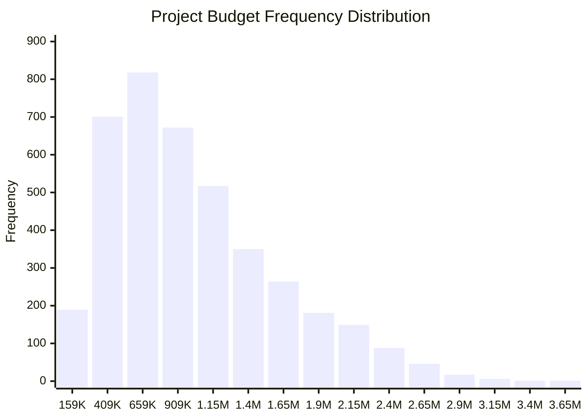

## 🧾 Project Overview

This project analyzes a dataset of **4,000 real-world project records** to explore how **budget correlates with risk level and complexity**. The goal is to surface patterns in budget allocation across projects and visualize how often projects fall into specific budget tiers—informing project scoping, resource allocation, and portfolio-level planning.

**Data Source:** [Kaggle – Project Management Risk Dataset](https://www.kaggle.com/datasets/ka66ledata/project-management-risk-raw)

---

## 📁 Dataset Snapshot

- **Total Records:** 4,000  
- **Features:** 51 columns including budget, team size, risk level, methodology, and stakeholder data  
- **Key Quantitative Variables:**  
  - `Project_Budget_USD`  
  - `Team_Size`  
  - `Complexity_Score`

---

## 📈 Budget Summary Statistics

| Metric               | Value           |
|----------------------|-----------------|
| Mean                 | $1,143,031.50   |
| Median               | $1,007,471.81   |
| Mode                 | $159,355.55     |
| Minimum              | $159,355.55     |
| Maximum              | $3,768,354.37   |
| Range                | $3,608,998.82   |
| Variance             | 349,136,947,199.23 |
| Standard Deviation   | $590,878.12     |

---

## 📊 Budget Distribution by Frequency

| Budget Range               | Frequency |
|---------------------------|-----------|
| $159,355 – $409,355       | 189       |
| $409,355 – $659,355       | 701       |
| $659,355 – $909,355       | 818       |
| $909,355 – $1,159,355     | 672       |
| $1,159,355 – $1,409,355   | 517       |
| $1,409,355 – $1,659,355   | 350       |
| $1,659,355 – $1,909,355   | 264       |
| $1,909,355 – $2,159,355   | 181       |
| $2,159,355 – $2,409,355   | 149       |
| $2,409,355 – $2,659,355   | 88        |
| $2,659,355 – $2,909,355   | 46        |
| $2,909,355 – $3,159,355   | 17        |
| $3,159,355 – $3,409,355   | 6         |
| $3,409,355 – $3,659,355   | 1         |
| $3,659,355 – $3,909,355   | 1         |

---

## 📉 Visualizing Budget Tiers

---

## 🧠 Observations

- The dataset is **right-skewed**, with most project budgets falling below $1.5M.
- Highest density appears in the $650K–$1.15M range.
- Very few projects exceed $2.5M, suggesting large projects are rare.
- **Implication:** Larger projects may require specialized risk frameworks and tailored resource strategies.

---

## 🛠 Tools & Methods

- **Excel** — Summary statistics, initial data prep
- **Python (pandas)** — Binning, calculations, cleaning
- **Mermaid.js** — Charts & visualizations
- **Tanstack Start** — Documentation and site presentation

---

## 📊 Data Philosophy

> *"Data without context is just noise; analysis without action is just an academic exercise."*

My approach focuses on actionable insights that guide portfolio planning, risk mitigation, and executive decision-making—not just interesting charts.

---

## 📂 Supporting Files

- **Excel Summary Workbook:** [Download](/assets/files/M4.5%20Final%20Project%20Phase%201%20Data%20Set.xlsx)

---

## 🔗 Related Pages

- [Analytics & Insights](/analytics) — Portfolio of applied analytics projects  
- [Strategy & Vision](/strategy) — How this analytical approach supports transformation initiatives  

---

📋 *Detailed methodology and code snippets available upon request. [Let's connect](/contact).*

