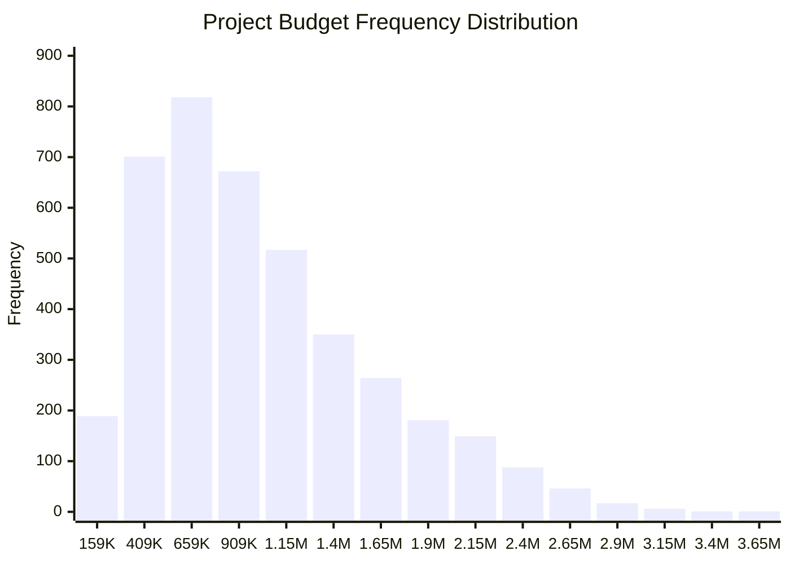

## 🧾 Project Overview

This project analyzes a dataset of 4,000 real-world project records to explore how budget correlates with risk level and complexity. The goal is to surface patterns in budget allocation across projects and visualize how often projects fall into specific budget tiers.

**Data Source**: [Kaggle – Project Management Risk Dataset](https://www.kaggle.com/datasets/ka66ledata/project-management-risk-raw)

---

## 📁 Dataset Snapshot

- **Total Records:** 4,000
- **Features:** 51 columns including budget, team size, risk level, methodology, and stakeholder data
- **Key Quantitative Variables:**
  - `Project_Budget_USD`
  - `Team_Size`
  - `Complexity_Score`

---

## 📈 Budget Summary Statistics

| Metric            | Value         |
|-------------------|---------------|
| Mean              | $1,143,031.50 |
| Median            | $1,007,471.81 |
| Mode              | $159,355.55   |
| Minimum           | $159,355.55   |
| Maximum           | $3,768,354.37 |
| Range             | $3,608,998.82 |
| Variance          | 349,136,947,199.23 |
| Standard Deviation| $590,878.12   |

---

## 📊 Budget Distribution by Frequency

| Budget Range | Frequency |
|--------------|-----------|
| $159,355 - $409,355 | 189 |
| $409,355 - $659,355 | 701 |
| $659,355 - $909,355 | 818 |
| $909,355 - $1,159,355 | 672 |
| $1,159,355 - $1,409,355 | 517 |
| $1,409,355 - $1,659,355 | 350 |
| $1,659,355 - $1,909,355 | 264 |
| $1,909,355 - $2,159,355 | 181 |
| $2,159,355 - $2,409,355 | 149 |
| $2,409,355 - $2,659,355 | 88 |
| $2,659,355 - $2,909,355 | 46 |
| $2,909,355 - $3,159,355 | 17 |
| $3,159,355 - $3,409,355 | 6 |
| $3,409,355 - $3,659,355 | 1 |
| $3,659,355 - $3,909,355 | 1 |

---

## 📉 Visualizing Budget Tiers

---

## 🧠 Observations

- The dataset is **right-skewed**, with most project budgets falling below $1.5M.
- High frequency is observed in the $650K – $1.15M budget range.
- Very few projects exceed $2.5M in budget, suggesting large projects are rare.
- This budget distribution can inform project scoping, resource allocation, and portfolio-level financial planning.

---

## 🧰 Tools Used

- Excel (for data prep & summaries)
- Python (pandas for binning & statistics)
- MkDocs with Material Theme
- Mermaid.js (for charts)

---

## 📊 Data Philosophy

> *"Data without context is just noise; analysis without action is just academic exercise."*

Whether examining budget distributions or forecasting project risks, my analytical approach focuses on surfacing actionable insights that drive better decision-making and measurable business outcomes—not just interesting statistics.

---

- ⬇️ *You can download the anlysis here: [Full Excel Summary Workbook](/assets/files/M4.5%20Final%20Project%20Phase%201%20Data%20Set.xlsx).*

---

📋 *Sample artifacts, documentation, and detailed case studies available upon request. [Let's connect](/contact).*

